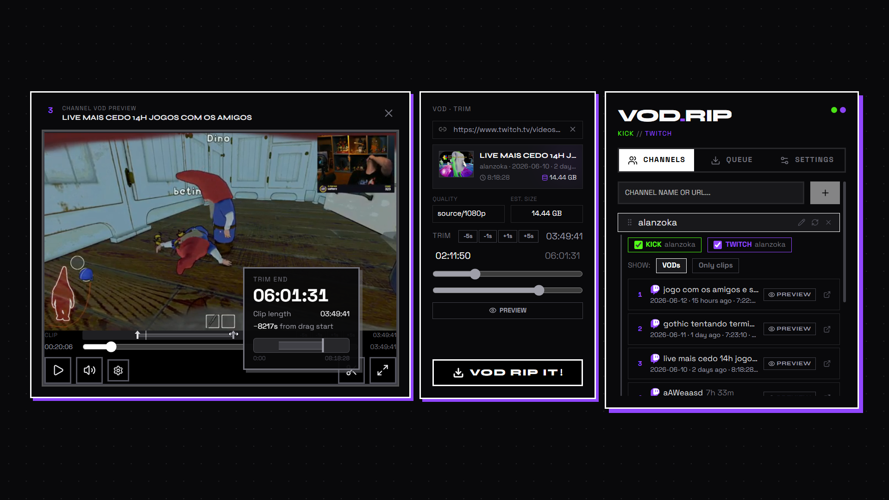
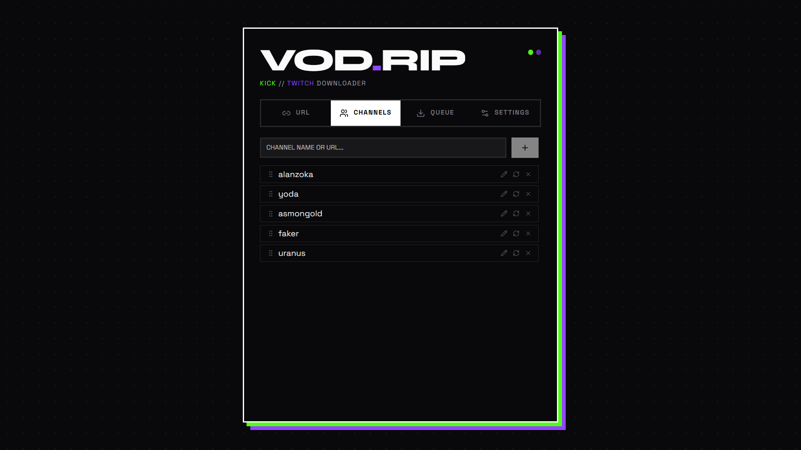
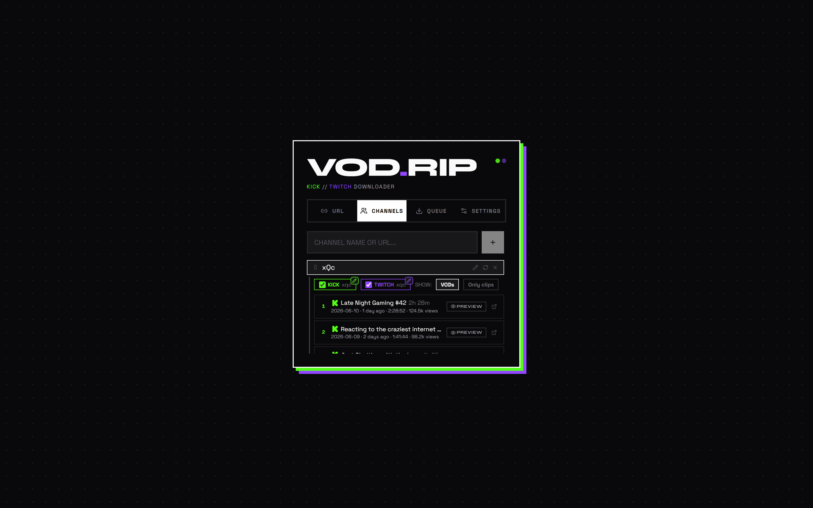
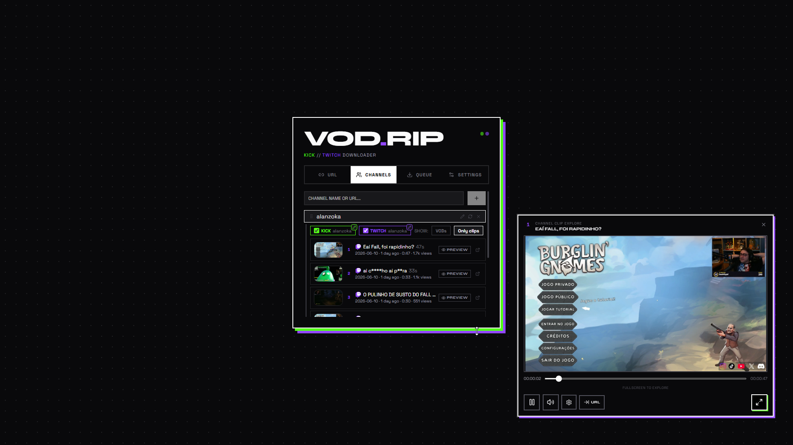

# VOD.RIP 🪦 - Twitch & Kick Downloader

A desktop app for downloading Twitch and Kick VODs, clips, and highlights. Select a channel, preview the content list, trim what you need, save, export to any video editor.

<p>
  <a href="https://github.com/mateusant13/VOD.RIP/releases"></a>
  <a href="https://github.com/mateusant13/VOD.RIP/releases"></a>
  <a href="LICENSE.txt"></a>
</p>

[Download the latest release](https://github.com/mateusant13/VOD.RIP/releases) - Windows, macOS, and Linux.



## Everything you need in one window

- **Download Twitch and Kick VODs** - full streams or trimmed segments
- **Save clips and highlights** - instant captures
- **Preview before downloading** - watch the VOD or clip inside the app
- **Trim only what you need** - skip a 3-hour stream, keep the 10-minute moment
- **Queue multiple downloads** - run them in parallel, track progress live
- **Save favorite channels** - recent VODs and clips, one click away


---

## Save your favorite channels

Pin the creators you watch and skip the search. The channels list keeps Twitch and Kick feeds side by side so recent uploads are always one click away.



## Browse recent VODs and clips

Open a channel to see the latest VODs and clips in a single view. Switch between Twitch and Kick, toggle VODs and clips, and start a download straight from the list.



## Preview before you download

From any VOD or clip row, pop the preview out into its own window. Watch the content in a smaller overlay while you keep browsing the list - no need to commit to a full download just to check what is in it.



## Download, trim, and save

Archiving a full stream or saving a highlight - the whole workflow lives in one window. Paste, preview, trim, download.


---

## Ready for Premiere & other editors

Kick and Twitch VODs download as **one `.mp4` file** you can drop straight into **Premiere Pro**, **DaVinci Resolve**. VOD.RIP handles the messy parts so you get an import-friendly file instead of raw chunks.

---

## Download

VOD.RIP ships as a standalone desktop app.

| Platform | Format |
|---|---|
| **Windows** | `.exe` installer or portable `.zip` |
| **macOS** | `.app` bundle |
| **Linux** | Portable `.zip` |

Grab the latest build from the [Releases page](https://github.com/mateusant13/VOD.RIP/releases).

## Run from source

```bash
npm install
cd backend
pip install -r requirements.txt
cd ..
npm run dev
```

Then open `http://localhost:5173`.

## Built with

- **Frontend:** React, TypeScript, Vite
- **Backend:** Python, FastAPI
- **Download engine:** yt-dlp
- **Desktop window:** PyWebView
- **Video processing:** FFmpeg

## License

[MIT](LICENSE.txt)
