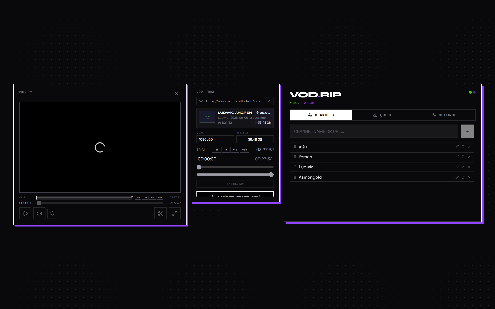
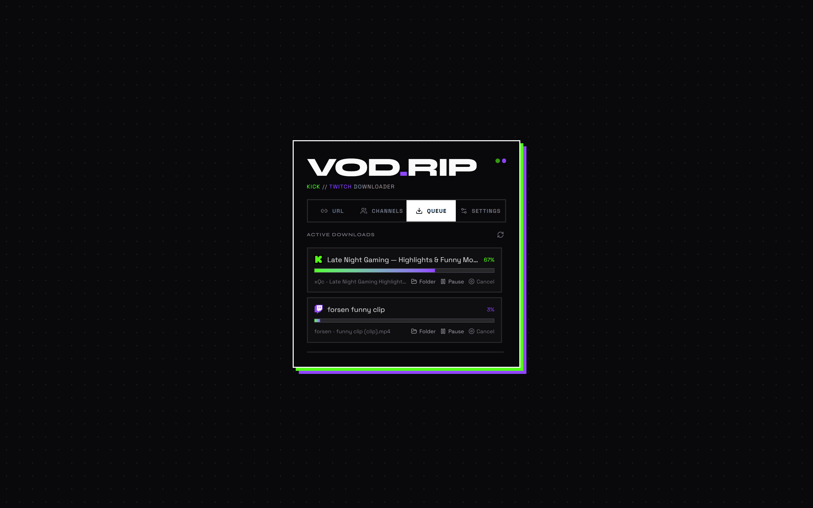

# VOD.RIP 🪦 - Kick and Twitch Downloader

Save Twitch and Kick VODs, clips, and highlights in a few clicks.

Preview before downloading, trim only the part you need, and manage multiple downloads from a single app.

<p>
  <a href="https://github.com/mateusant13/VOD.RIP/releases"></a>
  <a href="https://github.com/mateusant13/VOD.RIP/releases"></a>
  <a href="LICENSE.txt"></a>
</p>

[Download the latest release](https://github.com/mateusant13/VOD.RIP/releases) — no setup required.


## Why VOD.RIP?

Most download tools are built for power users. VOD.RIP focuses on making Twitch and Kick downloads simple.

1. Paste a link
2. Preview the content
3. Choose quality
4. Download

---

- **Download Twitch and Kick VODs** — full streams or just the parts you want
- **Download clips** — save short highlights instantly
- **Preview before downloading** — watch any VOD or clip inside the app
- **Trim only what you need** — don't download an entire stream for a 5-minute segment
- **Queue multiple downloads** — start several downloads at once and track progress
- **Save favorite channels** — browse recent VODs and clips without leaving the app

---

## Preview Before Downloading

See what you're getting before you commit. Paste a Kick or Twitch URL, extract the video info, and preview the content directly in the app. No need to wait for a full download just to check what's in it.



## Download Only What You Need

Pick a start and end point — download just the segment you care about. Drag the trim handles or click the in/out markers for precise control. Save a 10-minute highlight instead of a 3-hour VOD.


## Explore Channels

Browse any streamer's recent VODs and clips side by side. Switch between Kick and Twitch feeds, toggle between VODs and clips, and keep your favorite channels one click away.


## Manage Multiple Downloads

Download several VODs at the same time. The queue shows progress, speed, and estimated completion for each download. Start, pause, resume, or cancel at any time. Finished downloads stay in the history so you can find them again.



## Download

VOD.RIP runs as a standalone desktop app — no browser or command-line knowledge needed.

| Platform | Download |
|---|---|
| **Windows** | `.exe` installer or portable `.zip` |
| **macOS** | `.app` bundle |
| **Linux** | Portable `.zip` |

Grab the latest build from the [Releases page](https://github.com/mateusant13/VOD.RIP/releases).

## Run from Source

```bash
npm install
cd backend
pip install -r requirements.txt
cd ..
npm run dev
```

Then open `http://localhost:5173`.

## For Developers

VOD.RIP is built with:

- **Frontend:** React, TypeScript, Vite
- **Backend:** Python, FastAPI
- **Download engine:** yt-dlp
- **Desktop window:** PyWebView
- **Video processing:** FFmpeg

## License

[MIT](LICENSE.txt)
