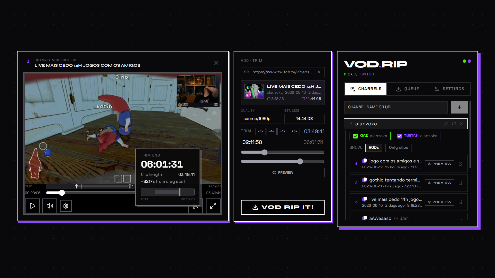
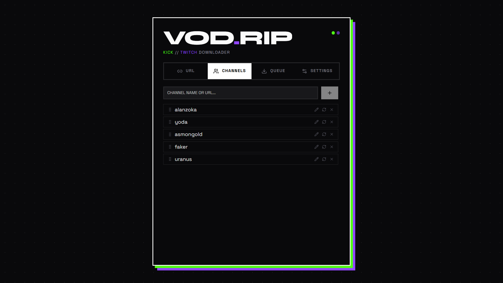
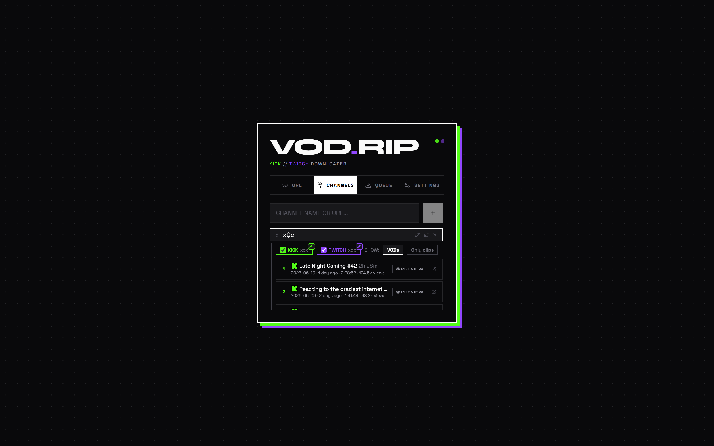
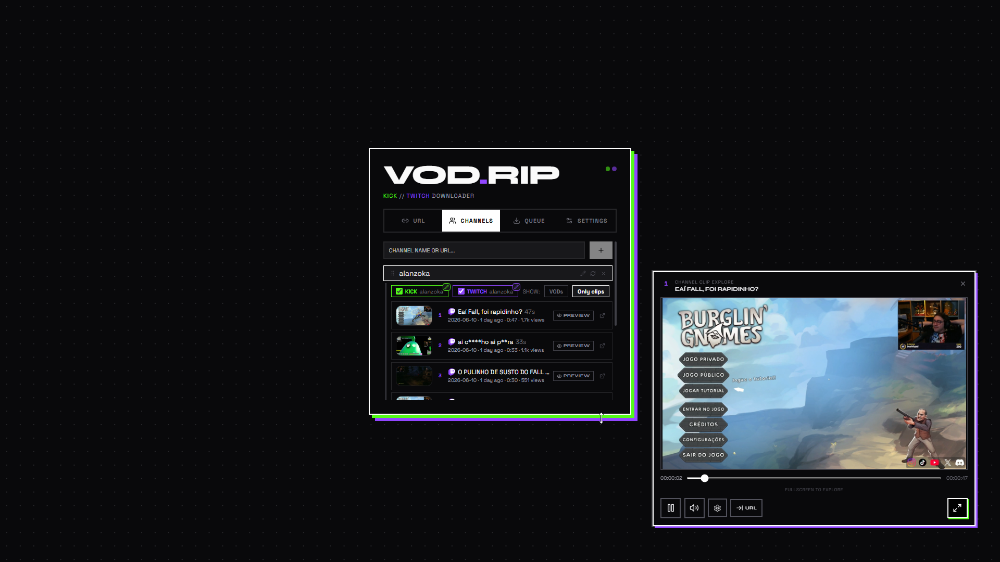

# VOD.RIP 🪦 - Twitch, Kick & YouTube Downloader

A desktop app for downloading Twitch, Kick, and YouTube VODs, clips, highlights, and live streams. Paste a link, preview the content, trim what you need, save an editor-ready file. Works offline, keeps everything on your machine, no account required.

<p>
  <a href="https://github.com/mateusant13/VOD.RIP/releases"></a>
  <a href="https://github.com/mateusant13/VOD.RIP/releases"></a>
  <a href="LICENSE.txt"></a>
</p>

[Download the latest release](https://github.com/mateusant13/VOD.RIP/releases) - Windows, macOS, and Linux.



---

## What you came for

- **Download VODs, clips, and highlights from Twitch, Kick, and YouTube** - full streams or trimmed segments, at the quality you pick
- **Preview before you download** - watch inside the app first, no need to commit to a download just to check what is in it
- **Trim to the moment** - skip the 3-hour stream, keep the 10 minutes you actually want
- **Record live streams** - catch a live broadcast on Twitch, Kick, or YouTube and save it as it happens
- **Queue downloads** - run several at once with live progress, pause, resume, or cancel any of them

## Why people stay

- **Editor-ready files** - one `.mp4` you can drop straight into Premiere, DaVinci Resolve, or VEGAS Pro. No raw chunks, no remuxing homework
- **Your channels, one place** - pin the creators you watch; Twitch, Kick, and YouTube feeds sit side by side, with live badges while they stream
- **Preview pop-outs** - pop any VOD or clip into its own overlay window and keep browsing
- **A searchable archive** - downloaded content is indexed locally, with search filters, dedupe, and transcripts for what you save
- **Built-in ad-blocking for Twitch** - the annoying parts are filtered out while you preview
- **Disk management** - see what is taking space and clean it up without leaving the app
- **Import local media** - open a video file you already have, trim it, and export like anything else
- **Comfort features** - resizable panels that remember your layout, keyboard shortcuts, adjustable UI scale, GPU-aware settings
- **Private by default** - everything runs on your machine, nothing is uploaded, no account, no telemetry







---

## Download

VOD.RIP ships as a standalone desktop app.

| Platform | Format |
|---|---|
| **Windows** | `.exe` installer or portable `.zip` |
| **macOS** | `.app` bundle |
| **Linux** | Portable `.zip` |

Grab the latest build from the [Releases page](https://github.com/mateusant13/VOD.RIP/releases).

## Run from source

```bash
npm install
cd backend
pip install -r requirements.txt
cd ..
npm run dev
```

Then open `http://localhost:5173`.

> **Windows users**: `curl_cffi` requires [Visual C++ Redistributable](https://aka.ms/vcruntime) and may need the [latest pip](https://pip.pypa.io/en/stable/installation/) version for binary wheel installation. If installation fails, try `pip install --upgrade pip` then `pip install curl-cffi==0.7.4`.

## Windows SmartScreen warning

The first time you run VOD.RIP, Windows may show **"Windows protected your PC"**.
This can happen with apps downloaded from the web.

Only download from the [official Releases page](https://github.com/mateusant13/VOD.RIP/releases).

**To install or run anyway:**

1. On the blue warning screen, click **More info** (on some builds: **More information**).
2. Click **Run anyway**.

---

## Optional: the Cookie Bridge extension (only if you need it)

**VOD.RIP works without any of this — in the vast majority of cases you will never touch this section.** It exists for the small percentage of downloads that need your logged-in browser session (for example, age-restricted or sign-in-only content on Kick, Twitch, or YouTube).

### What it is

VOD.RIP ships with a small companion browser extension — a modified, MIT-licensed fork of [Get cookies.txt LOCALLY](https://github.com/kairi003/Get-cookies.txt-LOCALLY). When installed, it reads the *login cookies only* for `kick.com`, `twitch.tv`, and `youtube.com` and hands them to VOD.RIP running on **this computer** (`127.0.0.1`). Nothing is sent anywhere else; only a small allow-listed set of auth-cookie names ever leaves the browser.

### Install it once (about 30 seconds)

1. Make sure VOD.RIP is running.
2. Open Chrome or Edge and go to `chrome://extensions`.
3. Turn on **Developer mode** (top-right corner).
4. Click **Load unpacked** and select the `cookie-extension\src` folder that ships next to the VOD.RIP app (`VOD-RIP.EXE` → same folder → `cookie-extension\src`). When running from source, that folder lives at `vendor\cookie-extension\src` in the repo.
5. Done. Pairing happens automatically the first time the extension talks to the app.

### How it behaves

- The extension pushes cookies **on install, on browser start, when your cookies change, and every 10 minutes** — you do not need to do anything per download.
- To confirm it is connected: open the extension popup — it shows **paired** — or check **Settings → Cookie Bridge** in the app for per-platform counts.
- If VOD.RIP is closed when a push happens, there is nothing to worry about: the next push (up to 10 minutes later, or immediately at your next download after opening the app) catches up automatically. No files are written anywhere.
- **Kill switch:** you can disable the bridge at any time from **Settings → Cookie Bridge** in the app. While disabled, the app refuses cookie data.

### Why this is a manual step (and not automatic)

Modern Chrome and Edge deliberately refuse to auto-install extensions that are not published on the official Chrome Web Store — that restriction exists to stop malware, and no flag, policy, or script can bypass it on an unmanaged computer. Publishing the fork on the Web Store would remove the manual step, but it costs a one-time developer registration and is only worth it if the bridge becomes a common need. Until then, the manual install above is the safe, free fallback.

The upcoming WebView2 desktop shell does not change any of this: the bridge lives in your browser, not in the app window, and keeps working regardless of how the app itself is hosted.

---

## Built with

- **Frontend:** React, TypeScript, Vite
- **Backend:** Python, FastAPI
- **Download engine:** yt-dlp
- **Desktop window:** PyWebView (WebView2 shell in progress)
- **Video processing:** FFmpeg
- **Companion extension:** Get cookies.txt LOCALLY (MIT) fork — see `THIRD-PARTY-LICENSES.txt`

## License

[MIT](LICENSE.txt)
